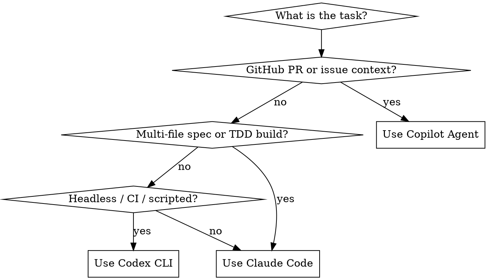

# Choosing Agent Mode

## Overview

Different agent modes have different strengths. Choosing the right mode for discovery, spec, or build workflows prevents wasted context and avoids tool mismatches.

## Quick Reference

| Mode | Best for | Repository context | Skill support |
|------|----------|--------------------|---------------|
| **GitHub Copilot Agent** | PR/issue triage, GitHub-aware discovery | Set by open PR or issue in GitHub UI | None natively |
| **Claude Code** | Spec, design, full TDD build workflows | Directory where Claude Code launches | Full Superpowers plugin marketplace |
| **Codex CLI** | Headless tasks, CI, scripted automation | Current working directory at launch | Native `~/.agents/skills/` discovery |

## How Repository Selection Works

**Copilot Agent:** The repository is determined by the GitHub PR or issue context. The agent reads files via the GitHub API. It does not have direct filesystem access unless a Codex sandbox is attached.

**Claude Code:** The repository is the directory (or git worktree root) where Claude Code is launched. `CLAUDE_PLUGIN_ROOT` points to the plugin installation. Use `superpowers:using-git-worktrees` to isolate parallel work.

**Codex CLI:** The repository is the current working directory when Codex is invoked. Skills are discovered from `~/.agents/skills/`. No additional configuration is needed after installation.

## Mode Selection Flowchart

## Workflow-Phase Guidance

**Discovery (understanding what to build):**
- Copilot Agent — ideal when starting from a GitHub issue or PR
- Codex CLI — ideal when scripting a scan of local files

**Spec / Design:**
- Claude Code + `superpowers:brainstorming` skill → full Socratic design process
- Results saved to `docs/plans/YYYY-MM-DD-<topic>-design.md`

**Build / Implement:**
- Claude Code + `superpowers:subagent-driven-development` for multi-task TDD
- Codex CLI for repeatable, headless task execution

**CI / Scheduled:**
- GitHub Actions + Codex CLI or plain Node.js scripts
- No interactive session needed; just script execution and exit codes

## Common Mistakes

| Mistake | Fix |
|---------|-----|
| Using Copilot Agent for deep multi-file refactoring | Switch to Claude Code; it has full filesystem access and skill support |
| Using Claude Code for a PR triage task | Use Copilot Agent; it has GitHub PR context natively |
| Running Codex without the `~/.agents/skills/superpowers` symlink | Follow `.codex/INSTALL.md` to set up the symlink first |
| Launching Claude Code in the wrong directory | Always launch from the repo root or the correct git worktree |
